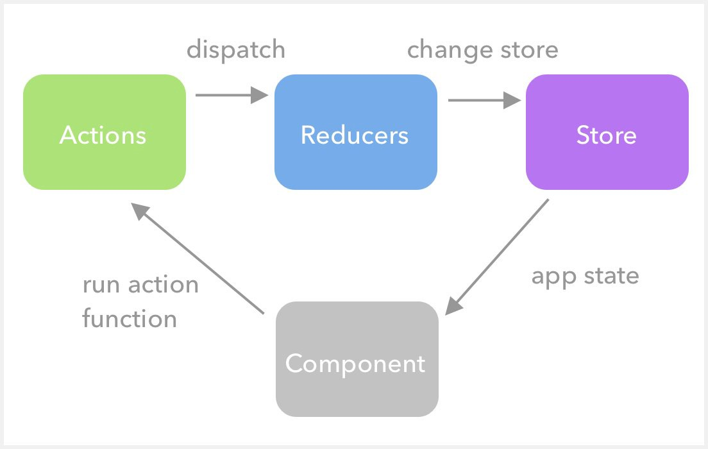

# Redux Basics

- Redux allows us to store the state of the application under a single **store** which is accessible for all components.
- This reduces the need for complex state logic and large props to be passed down to components.

## Core Concepts

| Term                          | Definition                                                                                                                                                                                              |
| ----------------------------- | ------------------------------------------------------------------------------------------------------------------------------------------------------------------------------------------------------- |
| State                         | Any data (I/O) and neccesary to run the application's components                                                                                                                                        |
| [Store](docs/c_stores.md)     | State of the application stored in a single place as a plain JS object model, with no setters available i.e the state inside is read only, and the only way to change is to emit or dispatch an action. |
| [Action](docs/a_actions.md)   | To change something in the state(inside the store), an action has to be dispatched, which is a plain JS object that has a type of action, and the payload associated with this action.                  |
| [Reducer](docs/b_reducers.md) | To tie the state and actions together, we need a pure function i.e. a reducer. This function takes the state and actions as arguments and returns the next state of the app.                            |

## File Structure

- [todoSlice.js](src/features/todo/todoSlice.js) contains the logic of the whole application. This file contains a createSlice function, which takes initial state and reducers and automatically generates all necessary code for the actions and action generators.
- [Todo.js](src/features/todo/Todo.js) is the top level component which houses the UI for the Todo-application. These have the dispatch hook useDispatch() in order to modify the state.
- [Tabs.js](src/features/todo/Tabs.js) contains Tab Components for the [Todo.js](src/features/todo/Todo.js). These contain the selector hook useSelector in order to get data from the generated slice and show it in the form of the list.

## Workflow

